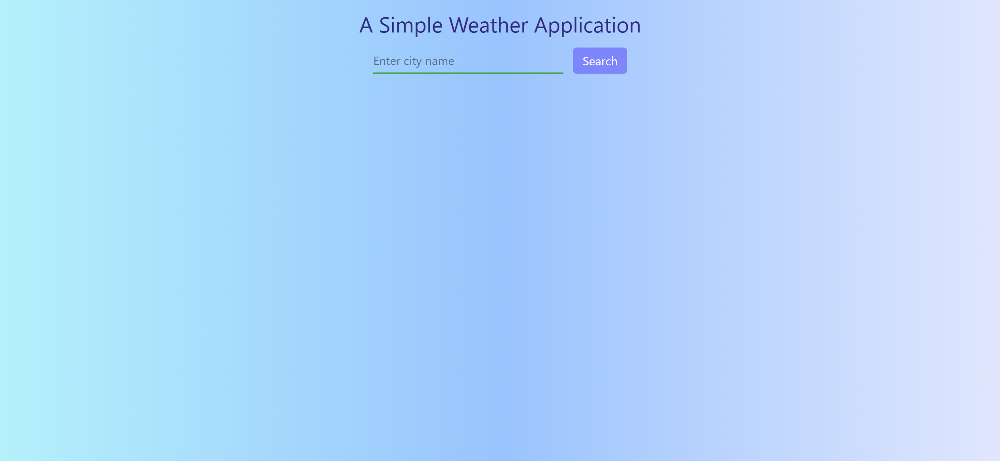

# Weather App

This is a simple Weather App for determining the weather in different parts of the world

## Features

-   Search for any city and get real-time weather updates
-   Displays temperature, condition and basic details
-   Clean UI

## Getting Started

-   Pre-requisites:
    -   [Node.js](https://nodejs.org) (latest stable version)
    -   [Git](https://git-scm.com/downloads)
    -   [VS code](https://code.visualstudio.com/download) or your favorite editor
-   Clone or Download the project code from [here](https://github.com/SivaKrishna6745/Weather-App)
-   Install Dependencies:
    `npm install`
    or
    `npm i`
-   Start the deployment server:
    `npm run dev`
-   Open your browser and visit:
    http://localhost:5173

## Tech Stack

-   ReactJS
-   Vite
-   Tailwind CSS

## Home Page

